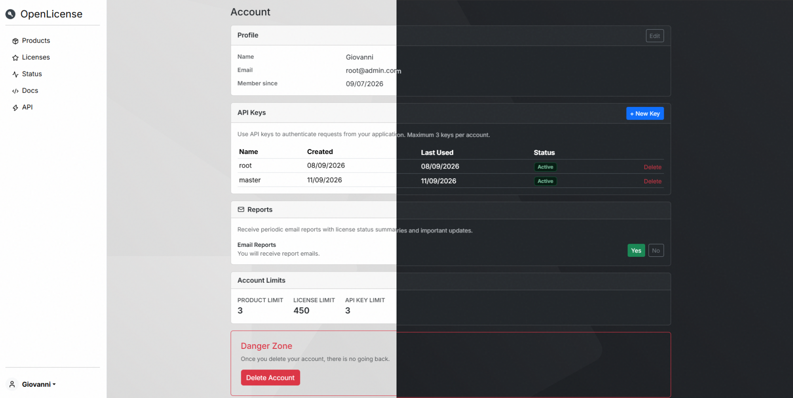
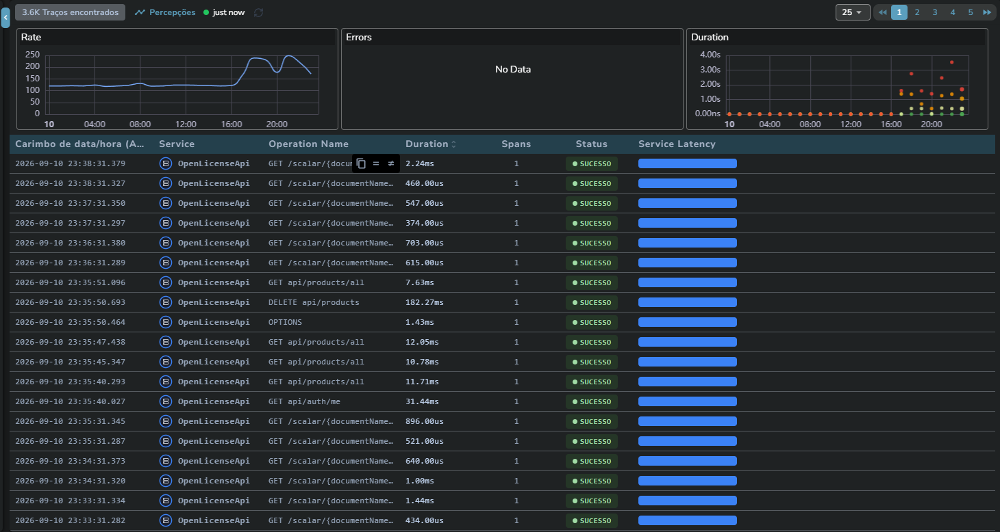
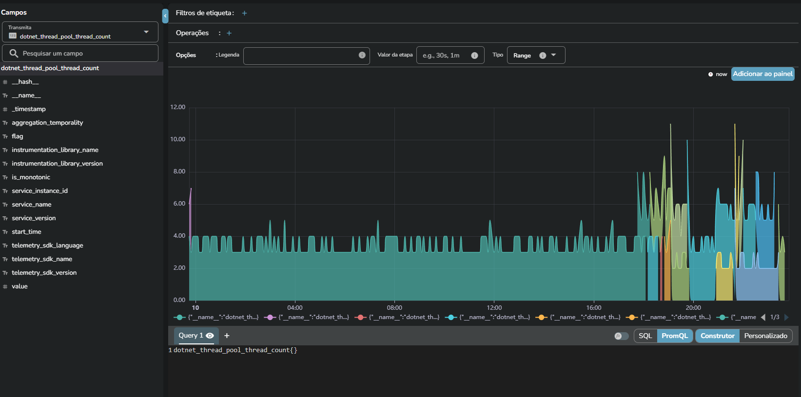

# OpenLicense

Self-hosted licensing platform for software vendors, SaaS teams, and digital product businesses that need to manage licenses, API access, activations, and operational visibility from one place.

<p align="center">
  
</p>

## Why OpenLicense

OpenLicense helps teams automate the lifecycle of software access:

- manage product licenses and client activations
- issue and revoke API keys securely
- centralize license validation in one backend
- monitor application health and user activity
- export traces, metrics and logs to OpenObserve

It is designed for teams that want a SaaS-style control layer without depending on a third-party licensing platform.

## Platform overview

<p align="center">
  <table>
    <tr>
      <td align="center"></td>
      <td align="center"></td>
    </tr>
  </table>
</p>

The API includes native OpenTelemetry support for exporting traces, metrics, and logs to OpenObserve, making it easier to debug production issues, monitor usage patterns, and understand license-related events in real time.

## Core features

- Product and license management
- Secure user authentication and authorization
- API key issuance and control
- Customer activation flows
- Email-based recovery and account protections
- Scheduled license status reports (opt-in, background service)
- Observability via OpenTelemetry / OTLP
- Containerized deployment with Docker Compose

## Quick start

```bash
# 1. Clone the repository
git clone <repo-url>
cd OpenLicense

# 2. Configure environment variables
cp .env.example .env
# Edit .env with your database, JWT secret, and telemetry settings

# 3. Start the stack
docker compose up -d
```

Then open:

- API: http://localhost:5000
- Dashboard: http://localhost:3000
- API docs: http://localhost:5000/scalar/v1

## OpenObserve integration

OpenLicense can send telemetry directly to OpenObserve using OTLP. This is useful for:

- monitoring API latency and errors
- investigating suspicious license activity
- observing request volume by endpoint
- correlating logs, traces, and metrics in a single view

Relevant environment variables include:

```env
OTEL_EXPORTER_OTLP_ENDPOINT=https://your-openobserve-instance/api/default
OTEL_EXPORTER_OTLP_HEADERS=Authorization=Basic <token>
```

See [docs/02-backend.md](docs/02-backend.md) and [docs/04-docker.md](docs/04-docker.md) for the backend and deployment details.

## Documentation

| Doc | Description |
|-----|-------------|
| [Architecture](docs/01-architecture.md) | System overview, data flow, auth architecture |
| [Backend](docs/02-backend.md) | Controllers, services, models, middleware, observability |
| [API Reference](docs/03-api-reference.md) | Endpoints, requests, payloads, responses |
| [Docker](docs/04-docker.md) | Compose and deployment setup |
| [Testing](docs/05-testing.md) | Test coverage and validation workflow |
| [Development](docs/06-development.md) | Local setup, conventions, debugging |

## Project status

OpenLicense is built as a self-hosted SaaS-style platform for licensing operations, product access control, and production monitoring.

## License

Custom Non-Commercial Software License. See [LICENSE.md](LICENSE.md). Commercial use prohibited without written permission.
