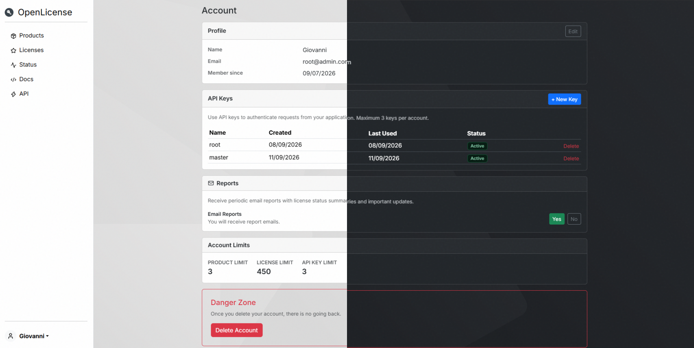
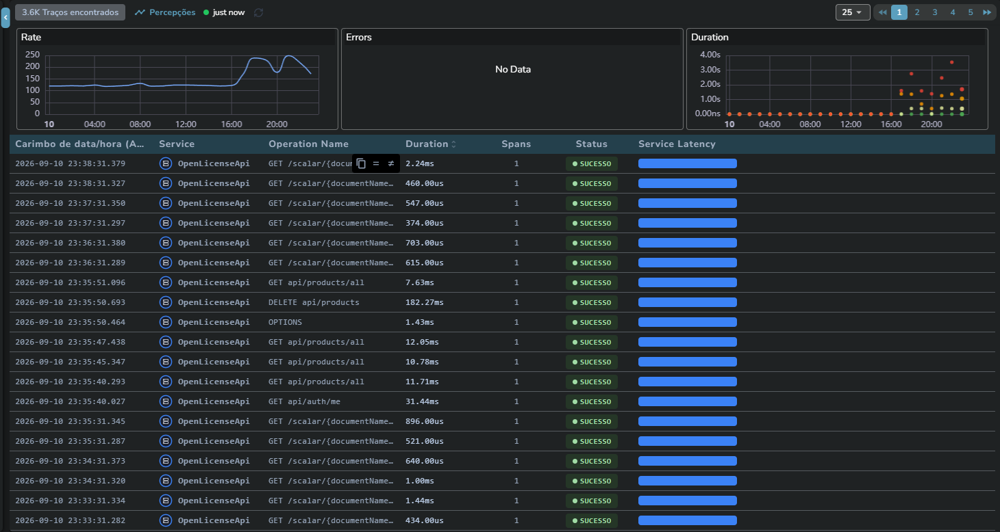
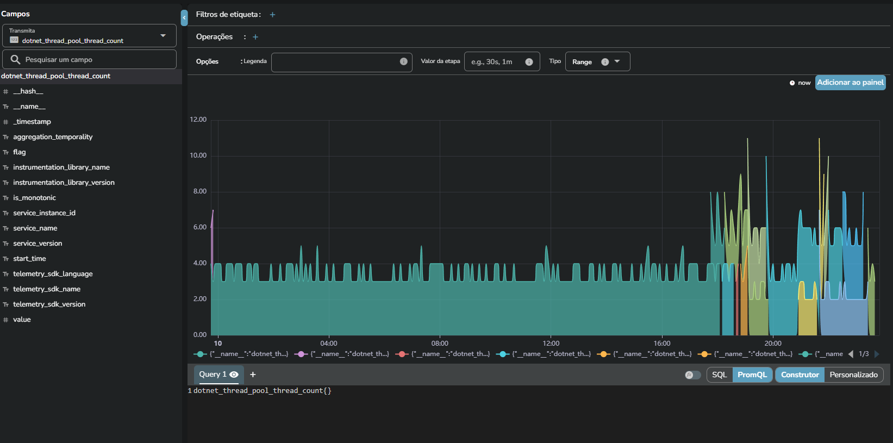

# OpenLicense

Self-hosted licensing platform for software vendors, SaaS teams, and digital product businesses that need to manage licenses, API access, activations, and operational visibility from one place.

<p align="center">
  
</p>

## Why OpenLicense

OpenLicense helps teams automate the lifecycle of software access:

- manage product licenses and client activations
- issue and revoke API keys securely
- centralize license validation in one backend
- monitor application health and user activity
- export traces, metrics and logs to OpenObserve

It is designed for teams that want a SaaS-style control layer without depending on a third-party licensing platform.

## Platform overview

<p align="center">
  <table>
    <tr>
      <td align="center"></td>
      <td align="center"></td>
    </tr>
  </table>
</p>

The API includes native OpenTelemetry support for exporting traces, metrics, and logs to OpenObserve, making it easier to debug production issues, monitor usage patterns, and understand license-related events in real time.

## Quick start

```bash
# 1. Clone the repository
git clone <repo-url>
cd OpenLicense

# 2. Configure environment variables
cp .env.example .env
# Edit .env with your database, JWT secret, and telemetry settings

# 3. Start the stack (builds from local source)
docker compose up -d
```


## Deployment options

| Mode | Compose file | Source |
|---|---|---|
| Latest | `docker-compose.yml` | Local source code |
| Release | `docker-compose.release.yml` | Git tag or branch from GitHub |

```bash
# Deploy from a release tag (downloads and builds from GitHub)
RELEASE_VERSION=v1.0.1 docker compose -f docker-compose.release.yml up -d

# Deploy from main branch (latest code from GitHub)
RELEASE_VERSION=main docker compose -f docker-compose.release.yml up -d
```

## Documentation

| Topic | Location |
|-------|----------|
| Architecture overview | [docs/01-architecture/overview](docs/01-architecture/overview.md) |
| CQRS & MediatR | [docs/01-architecture/cqrs-and-mediatr](docs/01-architecture/cqrs-and-mediatr.md) |
| Database design | [docs/01-architecture/database-design](docs/01-architecture/database-design.md) |
| Environment setup | [docs/02-getting-started/environment-setup](docs/02-getting-started/environment-setup.md) |
| Local development | [docs/02-getting-started/local-development](docs/02-getting-started/local-development.md) |
| API endpoints | [docs/03-api/endpoints](docs/03-api/endpoints.md) |
| Error handling | [docs/03-api/error-handling](docs/03-api/error-handling.md) |
| Full docs index | [docs/README](docs/README.md) |

## License

Custom Non-Commercial Software License. See [LICENSE.md](LICENSE.md). Commercial use prohibited without written permission.
