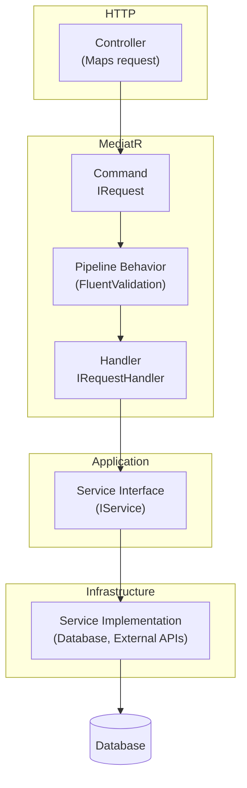
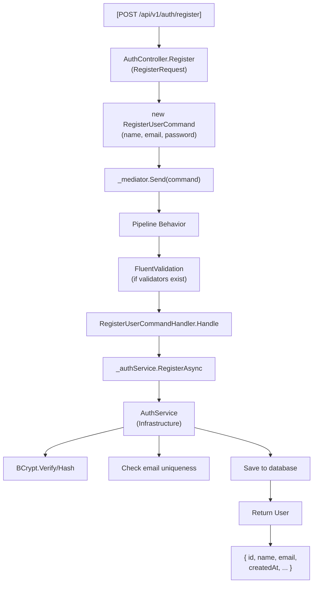

# CQRS and MediatR

OpenLicense implements **CQRS** (Command Query Responsibility Segregation) using **MediatR** to separate reads from writes.

## CQRS Flow

## Pipeline Behavior (Automatic Validation)

OpenLicense uses **FluentValidation** with pipeline behavior to validate commands/queries automatically.

The `ValidationBehavior<TRequest, TResponse>` in `Application/Common/ValidationBehavior.cs` implements `IPipelineBehavior<TRequest, TResponse>`. Before each handler executes, it looks up any FluentValidation validators registered for the request type, validates all rules, and throws a `ValidationException` if any failures are found. If validation passes, it calls the next delegate in the pipeline.

The pipeline behavior is registered in `Program.cs` using MediatR's configuration: `cfg.AddBehavior(typeof(IPipelineBehavior<,>), typeof(ValidationBehavior<,>))`. This ensures every command and query is validated before reaching its handler.

## Complete Operation Flow

## Creating a New Command/Query

### Checklist

1. **DTO** (if needed) -> `Application/DTOs/MyRequest.cs`
2. **Command/Query** -> `Application/Commands/.../MyCommand.cs` or `Application/Queries/.../MyQuery.cs`
3. **Handler** -> `Application/Handlers/.../MyHandler.cs`
4. **Service interface** (if new service) -> `Application/Services/Interfaces/IMyService.cs`
5. **Implementation** -> `Infrastructure/Services/MyService.cs`
6. **DI Registration** -> `Infrastructure/DependencyInjection.cs`
7. **Controller** -> `Api/Controllers/MyController.cs`

### Complete Example

To create a new command or query, follow these steps in order:

1. **Define the Command or Query record** — A simple record type inheriting from `IRequest<TResponse>`, e.g. `CreateWidgetCommand(Guid UserId, string Name) : IRequest<Widget>`. This file goes in the appropriate `Commands/` or `Queries/` subdirectory under `Application/`.

2. **Create the Handler** — A class implementing `IRequestHandler<CreateWidgetCommand, Widget>` that injects the relevant service interface via constructor and calls the service method in its `Handle()` method. This file goes in the corresponding `Handlers/` subdirectory.

3. **Define the Service Interface** (if new) — An interface like `IWidgetService` with a method `Task<Widget> CreateAsync(Guid userId, string name)`. This lives in `Application/Services/Interfaces/`.

4. **Implement the Service** — The concrete class implementing the interface, e.g. `WidgetService`, which accesses the database via `AppDbContext`. This lives in `Infrastructure/Services/`.

5. **Register in Dependency Injection** — Add `services.AddScoped<IWidgetService, WidgetService>()` in `Infrastructure/DependencyInjection.cs`.

6. **Add the Controller Endpoint** — Create or extend a controller with an HTTP method attribute like `[HttpPost]`, extract the userId from claims, create the command instance, and call `_mediator.Send()`. This lives in `Api/Controllers/`.
