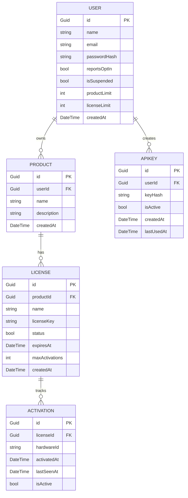

# Database Design

OpenLicense uses **PostgreSQL** with **Entity Framework Core** 9.0 and **Npgsql** 9.0.4.

## Entity Framework Core Setup

The `AppDbContext` in `Infrastructure/Persistence/AppDbContext.cs` defines DbSet properties for all five entities (Users, Products, Licenses, ApiKeys, Activations) and configures unique indexes on the LicenseKey and KeyHash fields in the OnModelCreating method.

## Entity Relationship Diagram

## Connection String

The connection string is configured via the `DATABASE_CONNECTION` or `database_connection` environment variable, following the Npgsql format: `Host=<your-db-host>:<port>;Database=postgres;Username=postgres;Password=...`
