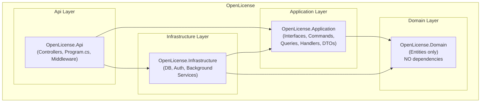
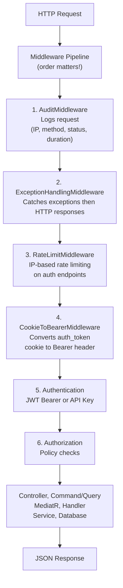
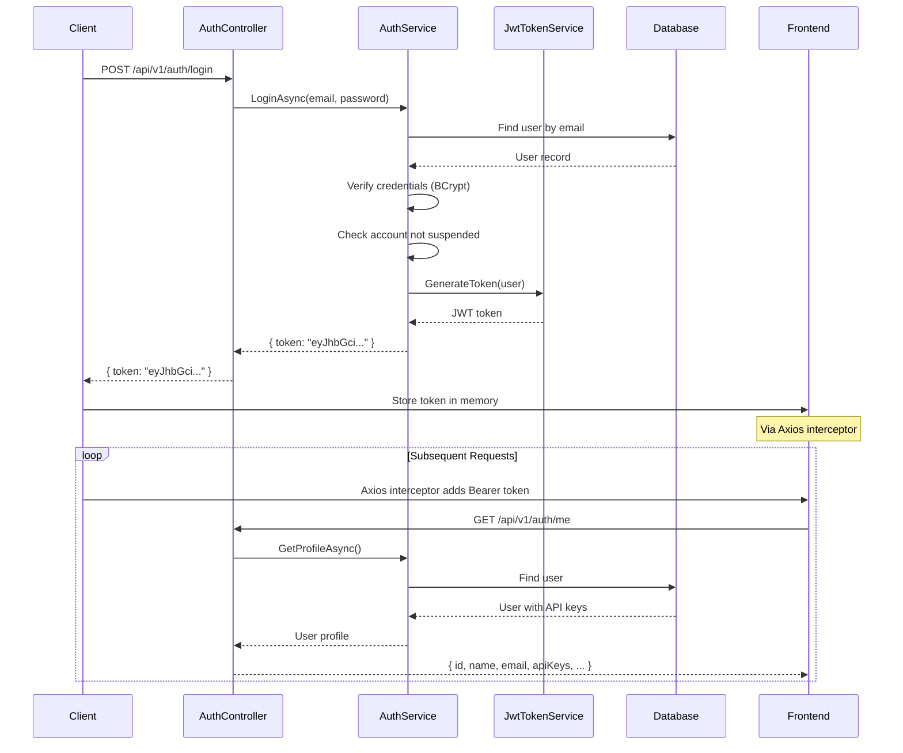

# Architecture Overview

## Overview

OpenLicense follows **Clean Architecture** with **CQRS** (Command Query Responsibility Segregation) via MediatR. The application is divided into 4 independent layers with well-defined responsibilities.

## Dependency Diagram

**Fundamental rule:** Dependencies point inward. `Api -> Application -> Domain`. Never the reverse.

## Layers

### 1. Domain (`OpenLicense.Domain`)

- **Responsibility:** Entities and intrinsic business rules
- **Dependencies:** None
- **Contains:** POCO entities / DTOs

### 2. Application (`OpenLicense.Application`)

- **Responsibility:** Application boundary — defines interfaces, commands, queries, handlers
- **Dependencies:** Domain
- **Contains:** DTOs, Service Interfaces, MediatR Commands/Queries, Handlers

### 3. Infrastructure (`OpenLicense.Infrastructure`)

- **Responsibility:** Concrete implementations — database, email, auth, background services
- **Dependencies:** Application, Domain
- **Contains:** Implemented services, DbContext, Auth handlers

### 4. Api (`OpenLicense.Api`)

- **Responsibility:** HTTP entry point, controllers, startup
- **Dependencies:** Application, Infrastructure, Domain
- **Contains:** Controllers, Program.cs, Middleware

## Request Lifecycle

## Authentication Flow

## Hybrid Authentication (JWT + API Key)

The API uses a **policy scheme** called `SmartAuth` that authenticates via:

- **JWT Bearer:** `Authorization: Bearer <token>`
- **API Key:** `X-Api-Key: api_<key>`

The scheme automatically detects which method to use.

## Observability

- **Traces/Metrics/Logs** -> OpenObserve via OpenTelemetry OTLP
- **Audit Logging** -> Middleware captures IP, status, duration, critical events
- **IP Resolution Priority:** Cloudflare -> Nginx -> X-Forwarded-For -> Remote IP
