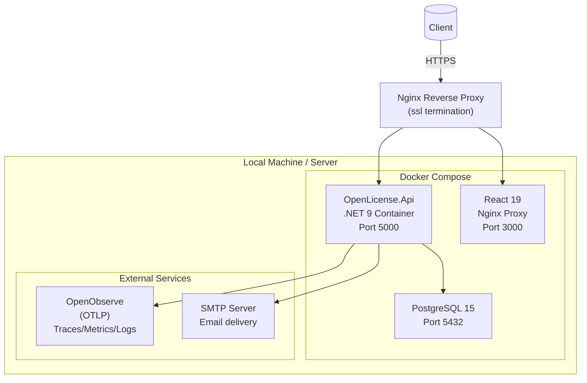

# Local Development

### Automated Script (Recommended)

The `start.sh` script at the project root starts both the backend and frontend in a single step. Make it executable and run it.

The script starts:
- **Backend:** `dotnet run` in `Backend/OpenLicense.Api/`
- **Frontend:** `npm run dev` in `Frontend/`
- Handles both on terminal close (SIGINT/SIGTERM)

### Manual Start

#### Backend

Navigate to `Backend/OpenLicense.Api/`, run `dotnet restore` to restore packages, then `dotnet run` to start the server.

The backend runs on `http://localhost:5000` or `http://localhost:5049` (if configured in `launchSettings.json`).

#### Frontend

Navigate to `Frontend/`, run `npm install` to install dependencies, then `npm run dev` to start the dev server.

The frontend runs on `http://localhost:3000`.

## Migrations

### Create Migration

Navigate to `Backend/OpenLicense.Api/` and run `dotnet ef migrations add MigrationName` to generate a migration file from model changes.

### Apply Migration

Navigate to `Backend/OpenLicense.Api/` and run `dotnet ef database update` to apply pending migrations.

### Remove Last Migration (local)

Run `dotnet ef migrations remove` to undo the last migration (local development only).

### Generate Migration SQL

Run `dotnet ef migrations script --id 20240101000000` to generate a SQL script for a migration.

## Default Ports

| Service | Port | URL |
|---------|------|-----|
| Backend | 5000 | http://localhost:5000 |
| Backend (dev) | 5049 | http://localhost:5049 |
| Frontend | 3000 | http://localhost:3000 |
| PostgreSQL | 5432 | localhost:5432 |

## Docker Deployment Architecture

## Development Tips

### Create a New Endpoint

1. Create DTO -> `Application/DTOs/MyRequest.cs`
2. Create Command -> `Application/Commands/.../MyCommand.cs`
3. Create Handler -> `Application/Handlers/.../MyHandler.cs`
4. Create Service Interface -> `Application/Services/Interfaces/IService.cs`
5. Implement Service -> `Infrastructure/Services/Service.cs`
6. Register DI -> `Infrastructure/DependencyInjection.cs`
7. Create Controller -> `Api/Controllers/MyController.cs`

### Create a New Entity

1. Create class -> `Backend/OpenLicense.Domain/Entities/MyEntity.cs`
2. Add DbSet -> `Infrastructure/Persistence/AppDbContext.cs`
3. Create migration -> `dotnet ef migrations add AddMyEntity`
4. Apply migration -> `dotnet ef database update`

### Validate Requests

Create a validator class in `Backend/OpenLicense.Application/Validators/MyRequestValidator.cs` that inherits from `AbstractValidator<MyRequest>`. Add `RuleFor(x => x.Name).NotEmpty().MaximumLength(40)` style rules. The `ValidationBehavior` pipeline will apply validation automatically.
