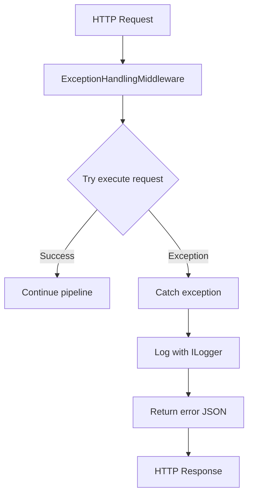
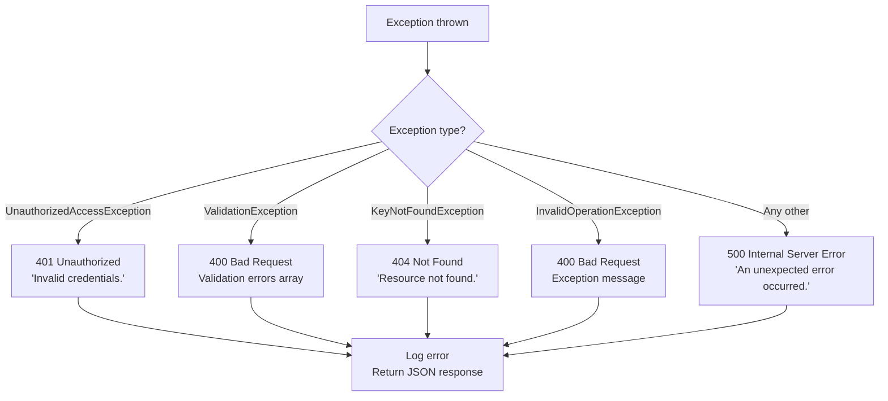
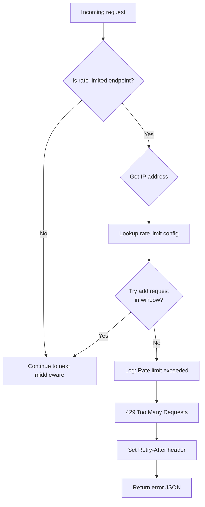

# Error Handling

OpenLicense uses **ExceptionHandlingMiddleware** to catch exceptions and return appropriate HTTP responses.

## Middleware Pipeline



## Error Response Format

### Default Response (400, 401, 404, 429)

```json
{
  "message": "Password must contain at least one uppercase letter, lowercase letter, digit, special character."
}
```

### ValidationException (FluentValidation)

```json
{
  "message": "Validation failed: Name is required. Email is required.",
  "errors": [
    {
      "PropertyName": "Name",
      "ErrorMessage": "Name is required."
    },
    {
      "PropertyName": "Email",
      "ErrorMessage": "Email is required."
    }
  ]
}
```

### Unauthorized (401)

```json
{
  "message": "Invalid credentials."
}
```

### Forbidden (403)

```json
{
  "message": "Registration is currently disabled."
}
```

### NotFound (404)

```json
{
  "message": "Product not found."
}
```

### Too Many Requests (429)

```json
{
  "message": "Too many requests. Please try again later."
}
```


## Exception Flow



## Common Exceptions

| Exception | HTTP Code | Description |
|-----------|-----------|-------------|
| `UnauthorizedAccessException` | 401 | Invalid credentials, account suspended |
| `ValidationException` | 400 | FluentValidation failed |
| `KeyNotFoundException` | 404 | Resource not found |
| `InvalidOperationException` | 400 | Business rule violated |
| Any other | 500 | Unexpected error (logged) |

## Rate Limiting

Rate limiting is implemented per IP on sensitive endpoints by the `RateLimitMiddleware` in `Api/Middleware/RateLimitMiddleware.cs`. It maintains a dictionary of rate limit configurations per endpoint, checks the client IP address, and uses the `IRateLimiterService` to track request counts within a sliding window. If the limit is exceeded, it returns a 429 Too Many Requests response with a `Retry-After` header.

### Rate Limit Table

| Endpoint | Limit | Window |
|----------|-------|--------|
| `POST /api/v1/auth/login` | 10 requests | 1 minute |
| `POST /api/v1/auth/register` | 5 requests | 5 minutes |
| `POST /api/v1/auth/forgot-password` | 3 requests | 5 minutes |
| `POST /api/v1/auth/reset-password/verify` | 6 requests | 5 minutes |
| `POST /api/v1/auth/reset-password` | 3 requests | 5 minutes |

### Rate Limit Headers

```
Retry-After: 45  // seconds until next allowed request
```

### Rate Limiting Flow



## Logging


### Audit Middleware

Captures:
- Client IP (resolved from proxy headers)
- HTTP method and path
- Status code
- Duration in ms
- User-Agent
- Correlation ID
- Authenticated user (if any)

**Audit events (critical endpoints):**
- `user_register` / `user_login` / `user_logout`
- `api_key_operation` / `license_operation` / `product_operation`
- `password_reset_requested` / `password_reset`
- `license_validate` / `license_deactivate`

### OpenTelemetry

Everything is exported to **OpenObserve** via OTLP:
- **Traces** -- request tracing
- **Metrics** -- latency, status codes
- **Logs** -- structured logs
