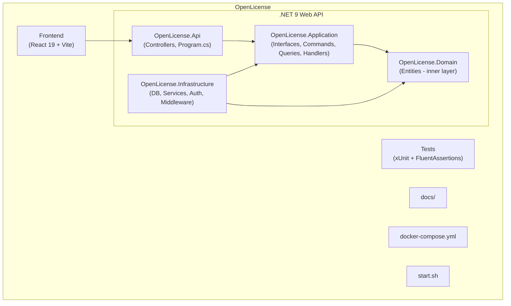
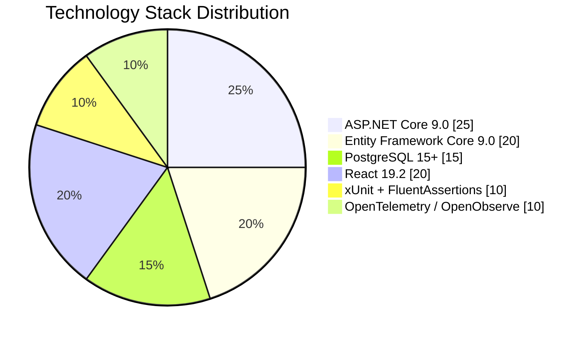

# OpenLicense Documentation

Complete software license and activation management system.

## Table of Contents

- [Architecture](01-architecture/overview.md) — Clean Architecture with CQRS overview
- [CQRS and MediatR](01-architecture/cqrs-and-mediatr.md) — CQRS pattern implementation
- [Database Design](01-architecture/database-design.md) — Data model and relationships
- [Getting Started](02-getting-started/environment-setup.md) — Environment setup
- [Local Development](02-getting-started/local-development.md) — Local development workflow
- [API Endpoints](03-api/endpoints.md) — Complete endpoint documentation
- [Error Handling](03-api/error-handling.md) — Error handling strategy

## Architecture

## Technology Stack

| Layer | Technology | Version |
|-------|-----------|---------|
| **API Framework** | ASP.NET Core | 9.0 |
| **Language** | C# | 12+ |
| **ORM** | Entity Framework Core | 9.0.17 |
| **Database** | PostgreSQL | 15+ |
| **Auth** | JWT Bearer + API Key | - |
| **Email** | MailKit / MimeKit | 4.17.0 |
| **Testing** | xUnit + FluentAssertions | 2.9.2 |
| **Frontend** | React | 19.2 |
| **Container** | Docker Compose | - |
